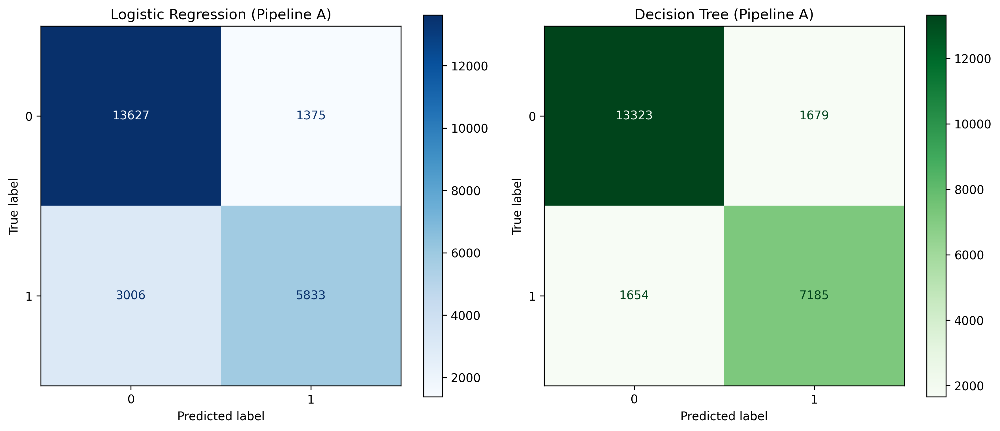

# DS605: Fundamentals of Machine Learning — Lab Assignment 3
**Scikit-learn: Data Preprocessing and Model Performance Evaluation**

- **Student Name:** Khushal Bafna
- **Student ID:** 202618005
- **Dataset Link:** [Kaggle Hotel Booking Demand Dataset](https://www.kaggle.com/datasets/jessemostipak/hotel-booking-demand)

---

## 1. Project Overview
This project builds, compares, and evaluates end-to-end Scikit-learn preprocessing pipelines paired with two classification algorithms: **Logistic Regression** and **Decision Tree Classifier**, to predict hotel booking cancellations (`is_canceled`).

---

## 2. Preprocessing & Data Cleaning Choices
1. **Target Leakage Prevention:** Removed `reservation_status` and `reservation_status_date` as they directly reveal the final booking outcome.
2. **High Missingness Handling:** Dropped the `company` column due to >94% missing values.
3. **Outlier Treatment (IQR & Business Logic):** 
   - Inspected numerical features using boxplots and IQR boundaries.
   - Removed extreme anomalies and impossible data entries (`adr < 0`, `adr >= 5000`, `adults + children + babies == 0`, and `adults > 10`), removing 186 rows in total.
4. **Scikit-learn Pipelines:**
   - **Pipeline A:** `KNNImputer(n_neighbors=5)` + `StandardScaler()` for numerical features.
   - **Pipeline B:** `KNNImputer(n_neighbors=5)` + `MinMaxScaler()` for numerical features.
   - **Categorical Processing:** `SimpleImputer(strategy='most_frequent')` + `OneHotEncoder(handle_unknown='ignore')`.
   - Data split with `test_size=0.2`, `stratify=y`, and `random_state=42`, fitted only on training data via `ColumnTransformer`.

---

## 3. Performance Comparison

| Model - Pipeline | Train Accuracy | Test Accuracy | Precision | Recall | F1-Score |
| :--- | :---: | :---: | :---: | :---: | :---: |
| **Logistic Regression (Pipeline A)** | 0.8182 | 0.8162 | 0.8092 | 0.6599 | 0.7270 |
| **Logistic Regression (Pipeline B)** | 0.8150 | 0.8135 | 0.8084 | 0.6512 | 0.7213 |
| **Decision Tree (Pipeline A)** | 0.9963 | 0.8602 | 0.8106 | 0.8129 | 0.8117 |
| **Decision Tree (Pipeline B)** | 0.9963 | 0.8602 | 0.8104 | 0.8132 | 0.8118 |

---

## 4. Confusion Matrices


---

## 5. Final Observations
- **Best Overall Setup:** The Decision Tree models delivered the strongest test results, reaching an accuracy of **86.02%** and an F1-score of **0.8118**, notably outperforming Logistic Regression (~81.6% accuracy, ~0.727 F1-score).
- **Scaler Impact on Logistic Regression:** Logistic Regression performed slightly better when paired with `StandardScaler` (Pipeline A) over `MinMaxScaler` (Pipeline B), with test accuracy increasing from 81.35% to 81.62% and recall from 65.12% to 65.99%. Standardizing to zero mean helped the linear optimization converge slightly better.
- **Scale Invariance in Decision Trees:** Feature scaling had no practical impact on the Decision Tree. Both `StandardScaler` and `MinMaxScaler` yielded identical accuracy (86.02%) and comparable F1-scores, demonstrating the scale-invariant nature of tree-based split criteria.
- **Overfitting Analysis:** The Decision Tree exhibited pronounced overfitting, obtaining near-perfect training accuracy (99.63%) but dropping by ~13.6% on the test set. In contrast, Logistic Regression generalized with virtually zero train-test discrepancy (81.82% train vs. 81.62% test).
- **Error Balance & Recall:** Confusion matrix inspection indicates that Logistic Regression had a high false-negative rate (recall of only ~66%), failing to detect a substantial portion of cancellations. The Decision Tree caught over 81% of actual cancellations, offering a far better operational balance.

---

## 6. Repository Structure
```text
├── README.md
├── code.ipynb
├── cleaned_hotel_bookings.csv
├── model_comparison_table.csv
└── confusion_matrices.png
