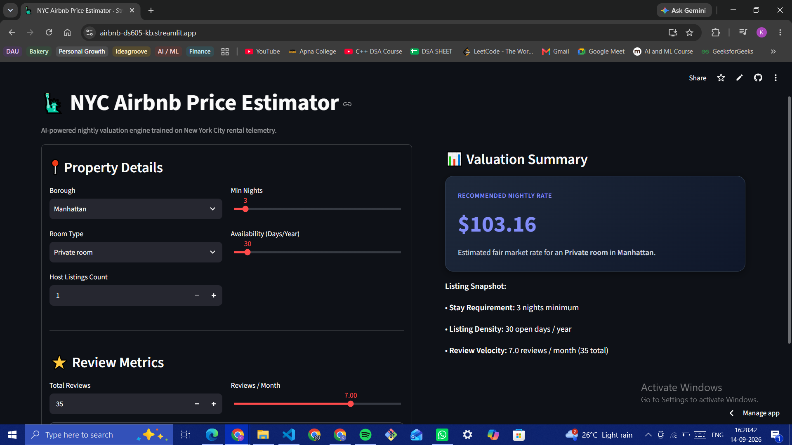

# 🗽 NYC Airbnb Price Prediction Pipeline

**Deployed Application:** `https://airbnb-ds605-kb.streamlit.app/`
**Backend API:** `https://two02618005-khushalbafna-ds605-1.onrender.com`

## Project Overview
This repository contains an end-to-end machine learning workflow predicting New York City Airbnb nightly prices. The project shifts from exploratory data analysis and model tuning in a Jupyter Notebook to a fully decoupled production architecture, utilizing a FastAPI backend for inference and a Streamlit frontend for user interaction.

## Task 1: Data Analysis and Preparation
The Kaggle AB_NYC_2019 dataset underwent significant preprocessing to handle extreme variance and categorical features:
* **Outlier Mitigation:** Filtered listings with a price of $0 and capped extreme high-end prices at the 99th percentile (~$799) to prevent regression weight skewing[cite: 1]. Minimum nights were capped at 365[cite: 1].
* **Transformations:** Applied a `log1p` transformation to the target `price` variable to normalize the highly right-skewed distribution[cite: 1]. 
* **Feature Engineering:** Implemented frequency encoding for high-cardinality `neighbourhood` data, mapping specific locales to their dataset frequency, while one-hot encoding the broader `neighbourhood_group` and `room_type`[cite: 1].

## Task 2: Model Training and Evaluation
Two primary tree-based ensemble models were trained and tuned using `RandomizedSearchCV`:

| Model | Test RMSE | Test MAE | Test R² |
| :--- | :--- | :--- | :--- |
| **Random Forest (Tuned)** | $93.96 | $47.65 | 0.405 |
| **XGBoost (Tuned)** | $94.39 | $48.07 | 0.399 |

**Selection:** The Tuned Random Forest was selected as the final production model due to its higher Test R² (0.405) and lower error metrics compared to XGBoost. It was serialized as `best_airbnb_model.pkl` alongside `model_features.pkl`.

## Task 3: Application Architecture
The final predictive model was deployed using a decoupled microservices approach:
* **Backend (Render):** A FastAPI service (`api/index.py`) receives HTTP POST requests, applies live one-hot encoding to match the expected feature columns, and runs inference using the saved Random Forest model.
* **Frontend (Streamlit):** A responsive, dark-mode user interface (`streamlit_app.py`) built on Streamlit Community Cloud allows users to dynamically adjust property attributes and view instant valuation estimates.

### UI Snapshot
 

## Task 4: Limitations & Future Scope
* **Temporal Blindness:** The dataset is a static snapshot from 2019. The model cannot account for seasonal price surges (e.g., holidays, summer demand) or macroeconomic inflation since 2019.
* **Feature Constraint:** The model lacks access to property amenities (e.g., pool, gym, elevator) or listing image quality, which are significant real-world drivers of premium pricing.

## Repository Structure
* `api/index.py` - FastAPI backend logic
* `streamlit_app.py` - Streamlit frontend interface
* `code.ipynb` - Complete EDA, preprocessing, and model training pipeline
* `output/` - Directory containing EDA plots (missing values, price distribution, geographic scatter)
* `screenshots/` - Directory containing UI screenshots
* `best_airbnb_model.pkl` & `model_features.pkl` - Serialized model and feature names
* `requirements.txt` - Deployment dependencies
